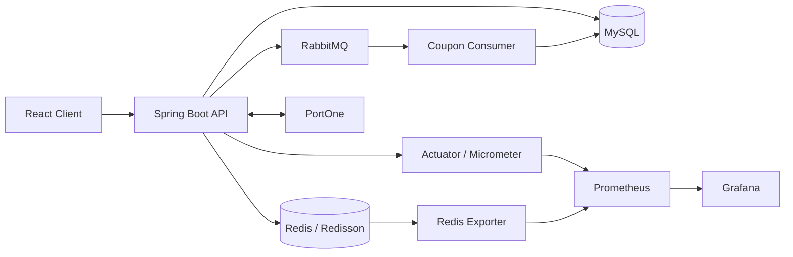

### 개인 E-commerce 프로젝트

결제, 쿠폰, 주문 흐름에서 발생하는 동시성 및 데이터 정합성 문제를 해결하고 운영 관점의 개선을 경험한 프로젝트입니다.

상품과 장바구니 같은 기본 결제 기능을 기반으로 PortOne 결제 검증, Redis 쿠폰 예약, RabbitMQ 이벤트 쿠폰 발급, 미완료 주문 아카이빙, 모니터링 환경을 구현했습니다.

> 개인 프로젝트 · Backend 중심 Full Stack 개발

## 목차

- [프로젝트 목표](#프로젝트-목표)
- [주요 기능](#주요-기능)
- [기술 스택](#기술-스택)
- [핵심 문제 해결](#핵심-문제-해결)
- [시스템 구성](#시스템-구성)
- [API 요약](#api-요약)
- [프로젝트 구조](#프로젝트-구조)
- [실행 방법](#로컬-실행-방법)
- [후속 과제](#후속-과제)

## 프로젝트 목표

- 외부 PG사 응답을 신뢰하기 전에 서버에서 결제 금액과 상태를 검증합니다.
- 결제창 이탈, 중복 요청, 웹훅 재전송에도 주문과 쿠폰 상태의 정합성을 유지합니다.
- 선착순 쿠폰 요청을 비동기로 처리하고 중복 발급과 재고 초과를 방지합니다.
- 결제 실패로 누적되는 미완료 주문을 추적 가능한 형태로 보존한 뒤 운영 DB에서 정리합니다.
- 애플리케이션과 Redis 지표를 수집해 병목을 측정할 수 있는 환경을 구성합니다.

## 주요 기능

| 영역        | 기능                                                                           |
| ----------- | ------------------------------------------------------------------------------ |
| 회원        | Spring Security 기반 로그인, JWT 발급·재발급, Kakao OAuth 2.0 로그인           |
| 상품        | 상품 등록·수정·삭제, 이미지 업로드, 목록·상세 조회                             |
| 장바구니    | 사용자별 장바구니 조회, 수량 변경, 상품 삭제                                   |
| 주문        | 주문 시점 상품·가격 스냅샷 저장, 주문 목록·상세·결제 내역 조회                 |
| 결제        | PortOne 결제 준비, 서버 검증, 결제창 이탈 처리, 웹훅 동기화                    |
| 쿠폰        | 쿠폰 정책 관리, 발급·조회·만료, 적용 가능 여부 및 할인 금액 계산               |
| 이벤트 쿠폰 | 요청 멱등성, Outbox 저장, RabbitMQ 발행·소비, ACK/NACK 및 DLQ 구성             |
| ETC         | 미완료 주문 CSV 아카이빙, Actuator·Prometheus·Grafana 모니터링, k6 부하 테스트 |

## 기술 스택

- **Backend:** Java 17, Spring Boot 3.5.5 (Web, Security, Validation, AOP, Actuator, Data JPA, AMQP), QueryDSL, MySQL,
  Redis, Redisson, RabbitMQ, JWT
- **Frontend:** React 19, TypeScript, Vite, Zustand, Redux Toolkit, React Query, Tailwind CSS
- **External:** PortOne, Kakao OAuth 2.0
- **Monitoring & Test:** Micrometer, Brave Tracing, Prometheus, Grafana, Redis Exporter, k6, JUnit 5
- **Infra & DevOps:** Docker, Docker Compose, Vercel

## 핵심 문제 해결

### 1. 외부 결제 결과와 내부 주문 상태의 정합성 확보

클라이언트의 결제 성공 응답만으로 주문을 완료하면 금액 변조, 중복 요청, 재고 변경에 대응하기 어렵다고 판단했습니다.

- 결제 준비 시 장바구니의 상품명, 가격, 수량을 주문 스냅샷으로 저장했습니다.
- 결제 완료 요청과 웹훅 수신 시 PortOne API에서 결제 상태와 실제 결제 금액을 다시 조회합니다.
- 결제 금액 불일치나 재고 부족이 확인되면 PG 결제를 취소하고 내부 트랜잭션을 롤백합니다.
- 결제 ID와 상품별 Redisson 락을 사용해 동일 결제의 중복 처리와 재고 차감 충돌을 방지했습니다.
- 웹훅은 서명을 검증하고 Redis와 DB 이력으로 중복 처리를 차단했습니다.

### 2. 결제창 이탈 시 쿠폰이 사라지는 문제 개선

기존에는 결제창을 여는 시점에 쿠폰 상태를 변경해, 사용자가 결제를 완료하지 않고 창을 닫아도 쿠폰이 목록에서 사라질 수 있었습니다.

- 쿠폰의 DB 상태는 유지하고 Redis `SET NX`와 TTL을 이용해 결제 준비 기간에만 임시 예약합니다.
- 동일 쿠폰으로 여러 결제창을 여는 행위는 예약 키를 통해 차단합니다.
- 결제 성공 시 쿠폰을 사용 완료로 확정하고, 실패하거나 결제창을 닫으면 예약을 해제합니다.
- Redis 값 비교 후 삭제하는 방식으로 다른 요청이 만든 예약을 잘못 해제하지 않도록 처리했습니다.

### 3. 선착순 쿠폰 발급의 중복 요청과 메시지 유실 대응

동시 요청이 집중되는 선착순 쿠폰 발급을 요청 접수와 실제 발급 처리로 분리했습니다.

- `requestKey`를 기준으로 발급 요청을 멱등 처리합니다.
- 발급 요청과 Outbox 레코드를 하나의 트랜잭션에 저장해 DB 변경과 메시지 발행 의도를 함께 기록합니다.
- Publisher Confirm 결과에 따라 `PUBLISHED`, `PUBLISH_FAILED`, `CONFIRM_UNKNOWN` 상태를 구분합니다.
- RabbitMQ Consumer에서 처리 성공 후 수동 ACK하고, 실패 메시지는 NACK 후 DLQ로 전달합니다.
- 조건부 상태 변경과 DB 제약 조건으로 메시지 재처리 시 중복 발급을 방지합니다.

### 4. 미완료 주문 데이터 아카이빙

결제 검증 실패나 사용자 이탈로 생성된 미완료 주문이 운영 테이블에 계속 누적되는 문제를 발견했습니다. 장애 분석과 고객 문의에 필요한 데이터는 보존하면서, 운영 DB의 데이터 부담을 줄이기 위해 CSV 아카이빙
기능을 구현했습니다.

#### 구현 내용

- 즉시성 결제수단은 30분, 가상계좌 등 지연성·미분류 결제수단은 72시간 보존 후 아카이빙합니다.
- 주문 데이터를 CSV로 먼저 저장하고, 모든 행의 저장이 확인된 주문만 DB에서 삭제합니다.
- `archiveKey`를 기준으로 배치 재실행 시 동일한 데이터가 중복 저장되지 않도록 처리했습니다.
- 결제 동기화용 Redisson 락을 획득한 뒤 대상 여부를 다시 확인하고, 삭제 직전 `PESSIMISTIC_WRITE` 락으로 주문 상태를 재검증했습니다.
- CSV 특수문자를 escape하고 스프레드시트 수식으로 해석될 수 있는 값을 무해화했습니다.

#### 성능 검증 결과

#### 10K 성능 비교

<table>
  <tr>
    <th>Before</th>
    <th>After</th>
  </tr>
  <tr>
    <td></td>
    <td></td>
  </tr>
  <tr>
    <td><a href="https://raw.githubusercontent.com/peeljunKim/personal-react-spring-project/main/k6/k6-reporter-10k-before.html">Before 상세 보고서</a></td>
    <td><a href="https://raw.githubusercontent.com/peeljunKim/personal-react-spring-project/main/k6/k6-reporter-10k-after.html">After 상세 보고서</a></td>
  </tr>
</table>

<br>

#### 50K 성능 비교

<table>
  <tr>
    <th>Before</th>
    <th>After</th>
  </tr>
  <tr>
    <td></td>
    <td></td>
  </tr>
  <tr>
    <td><a href="https://raw.githubusercontent.com/peeljunKim/personal-react-spring-project/main/k6/k6-reporter-50k-before.html">Before 상세 보고서</a></td>
    <td><a href="https://raw.githubusercontent.com/peeljunKim/personal-react-spring-project/main/k6/k6-reporter-50k-after.html">After 상세 보고서</a></td>
  </tr>
</table>

k6로 아카이빙 전후 성능을 비교한 결과, 미완료 주문 1만 건에서는 유의미한 차이가 나타나지 않았습니다. 반면 5만 건 누적 환경에서는 아카이빙 후 TPS가 약 4% 향상되고 응답 지연 시간이 약 21%
감소했습니다.

## 시스템 구성



## API 요약

| 도메인   | Method | Endpoint                               | 설명                      |
| -------- | ------ | -------------------------------------- | ------------------------- |
| 회원     | POST   | `/api/member/login`                    | 로그인 및 JWT 발급        |
| 회원     | POST   | `/api/member/refresh`                  | 토큰 재발급               |
| 상품     | GET    | `/api/products/list`                   | 상품 목록 조회            |
| 상품     | POST   | `/api/products`                        | 상품 등록                 |
| 장바구니 | GET    | `/api/cart/items`                      | 장바구니 조회             |
| 장바구니 | POST   | `/api/cart/change`                     | 수량 변경 및 상품 추가    |
| 주문     | GET    | `/api/orders`                          | 주문 목록 조회            |
| 주문     | GET    | `/api/orders/{orderId}`                | 주문 상세 조회            |
| 결제     | POST   | `/api/payments/prepare`                | 주문 스냅샷 및 결제 준비  |
| 결제     | POST   | `/api/payments/complete`               | PG 조회 후 결제 검증·확정 |
| 결제     | POST   | `/api/payments/release`                | 결제창 이탈 처리          |
| 결제     | POST   | `/api/payments/webhook`                | PortOne 웹훅 처리         |
| 쿠폰     | POST   | `/api/coupons/{policyId}/issue`        | 일반 쿠폰 발급            |
| 쿠폰     | POST   | `/api/coupons/events/{policyId}/issue` | 이벤트 쿠폰 발급 요청     |
| 쿠폰     | GET    | `/api/me/coupons`                      | 보유 쿠폰 조회            |

## 프로젝트 구조

```text
personal-project
├─ backend/personal.project
│  ├─ src/main/java/org/personal/project
│  │  ├─ controller       # REST API
│  │  ├─ service          # 주문·결제·쿠폰 유스케이스
│  │  ├─ repository       # Spring Data JPA·QueryDSL
│  │  ├─ entity           # 커머스·쿠폰·PG 도메인 모델
│  │  ├─ config           # Security·Redis·RabbitMQ·Metrics 설정
│  │  ├─ aspect           # Redisson 분산 락 AOP
│  │  └─ security         # JWT 필터 및 인증 핸들러
│  └─ src/test            # 단위·통합 테스트
├─ front                  # React·TypeScript 클라이언트
├─ infra
│  ├─ local               # Redis·RabbitMQ 구성
│  └─ monitoring          # Prometheus·Grafana·Redis Exporter
├─ k6                     # 부하 테스트와 데이터 준비 스크립트
└─ docs                   # 정리 문서
```

## 로컬 실행 방법

### 요구 사항

- Java 17
- Node.js 20 이상
- Docker Desktop

### 1. 인프라 실행

```bash
docker compose -f infra/local/docker-compose.yml up -d
```

### 2. Backend 실행

```powershell
cd backend/personal.project
.\gradlew.bat bootRun
```

Backend는 기본적으로 `http://localhost:8080`에서 실행됩니다. 실제 결제 연동에는 `PORTONE_API_SECRET`, `PORTONE_STORE_ID`,
`PORTONE_CHANNEL_KEY`, `PORTONE_WEBHOOK_URL`, `PORTONE_WEBHOOK_SECRET` 환경 변수가 필요합니다.

### 3. Frontend 실행

```bash
cd front
npm install
npm run dev
```

### 4. 모니터링 실행

```bash
docker compose -f infra/monitoring/docker-compose.yml up -d
```

- Prometheus: `http://localhost:9090`
- Grafana: `http://localhost:3000`
- RabbitMQ Management: `http://localhost:15672`

## 후속 과제

- Outbox Publisher를 주기적으로 실행하는 디스패처를 연결하고 `CONFIRM_UNKNOWN` 상태를 재조정하는 복구 작업 추가
- 로컬 CSV 아카이브를 S3와 같은 오브젝트 스토리지로 확장
